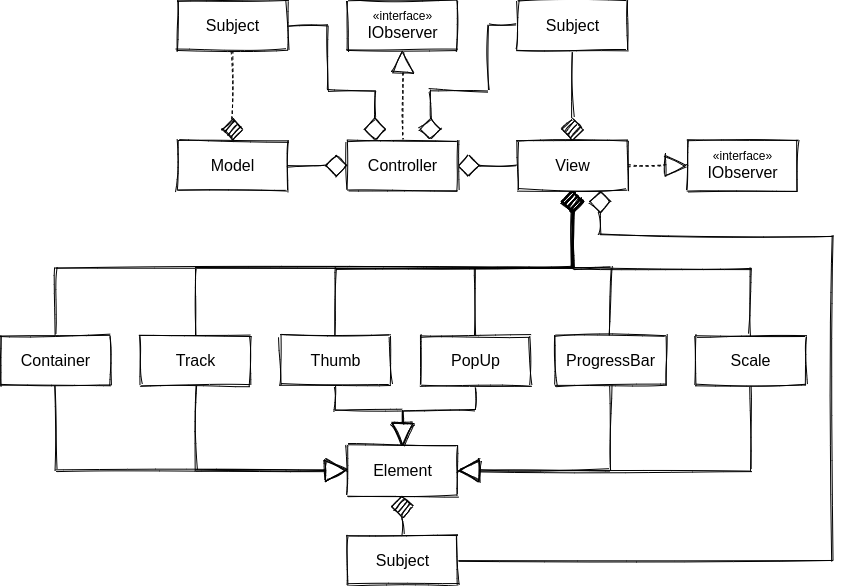

# Incredible slider plugin
Incredible slider plugin - простой в использовании сдайдер для быстрого выбора значения или диапазона значений.
Ссылка на демо - https://metalhead89.github.io/fsd_demo_slider_page/

## Особенности:
- два режима работы: "одиночный" - для выбора одного значения и "диапазон" - для выбора диапазона значений;
- горизонтальное и вертикальное представление;
- возможность задавать величину шага, а также минимальное и максимальное значение;
- возможность включения/отключения отображения шкалы и блоков со значениями над бегунками;
- удобное API, позволяющее изменять настройки плагина во время работы из кода.

## Содержание

1. [Работа с проектом](#работа-с-проектом)
    * [Установка](#установка)
    * [Команды](#команды)
2. [Установка плагина](#установка-плагина)
3. [Использование](#использование)
	* [Добавление слайдера в DOM](#добавление-слайдера-в-dom)
	* [Настройки по-умолчанию](#настройки-по-умолчанию)
	* [Пользовательские настройки](#пользовательские-настройки)
	* [API](#api)
4. [Архитектура](#архитектура)

## Работа с проектом

### Установка

Cкопируйте репозиторий:

	https://github.com/MetalHead89/fsd_part4.git

Установите зависимости:

	npm install

### Команды

Запуск сервера разработки:

	npm start

Development сборка:

	npm run dev

Production сборка:

	npm run build

Запуск тестов:

	npm test

Запуск тестов с покрытием:

	nom run coverage

## Установка плагина

>Внимание! Для работы плагина ваш проект дожен поддерживать работу с TypeScript, scss и jQuery. Если во время работы со слайдером в вашем проекте возникают ошибки, убедитесь, что выполнена установка соответствующих пакетов и произведена настройка сборщика для работы с ними.

Скопируйте каталог sliderPlugin из репозитория проекта:

    https://github.com/MetalHead89/fsd_part4/tree/master/src/plugins

Импортируйте плагин в точке входа вашего проекта:

    import 'путьДоКаталогаSliderPlugin/sliderPlugin/incredibleSliderPlugin.ts'

Импортируйте стили плагина в точке входа вашего проекта:

    import 'путьДоКаталогаSliderPlugin/sliderPlugin/styles/style.scss'

## Использование

### Добавление слайдера в DOM

Слайдер размещается в пустом div элементе, который служит для него обёрткой. Поэтому первым шагом к добавлению слайдера в DOM, будет создание div элемента в месте, где должен находиться слайдер. Это можно сделать, как через HTML разметку, так и динамически в js коде. Например:
	
	const sliderWrapper = document.createElement('div');
	const body = document.querySelector('body');
	body.append(sliderWrapper);

Вторым шагом будет вызов функции incredibleSliderPlugin() у обёрнутого в jQuery элемента, созданного ранее:

	$(sliderWrapper).incredibleSliderPlugin();

Готово! Слайдер добавлен в DOM и готов к работе.

### Настройки по-умолчанию

На предыдущем шаге нами был успешно создан слайдер с настройками по-умолчанию. Они имеют следующий вид:

* ориентация: горизонтальная;
* тип: диапазон;
* шкала: отбражается;
* значения над бегунками: отображаются;       
* минимальное значение: 0;
* максимальное значение: 10;
* величина шага: 1

### Пользовательские настройки

Настройки по-умолчанию удобны для быстрого создания нового слайдера, но в подавляющем большинстве случаев, необходим слайдер с иным диапазоном значений или другим типом. Для этого в плагине предусмотрена возможность конфигурирования настроек при создании слайдера. Всё что тербуется сделать - это передать в метод incredibleSliderPlugin() объект с необходимыми настройками, специфичными для текущего проекта:

	$(sliderWrapper).incredibleSliderPlugin({'min': 60, 'max': 4000, 'orientation': 'vertical'});

#### Изменяемые опции для пользовательских настроек:

| Опция | Тип | Возможные значения | Значение по-умолчанию | Описание |
|:-:|:-:|:-:|-|:-:|
| orientation | string | horizontal или vertical | horizontal | Ориентация слайдера. horizontal - горизонтальная, vertical - вертикальная |
| type | string | single или range | range | Тип слайдера. single - одно значение, range - диапазон значений |
| scale | boolean | true или false | true | Режим отображения шкалы. true - шкала отображается, false - шкала скрыта |
| tooltips | boolean | true или false | true | Режим отображения значений над бегунками. true - значения отображаются, false - значения скрыты |
| min | number | любое целое значение | 0 | Минимальное значение слайдера |
| max | number | любое целое значение | 10 | Максимальное значение слайдера |
| step | number | любое целое значение большее нуля | 1 | Величина шага |

### API

Помимо конфигурирования во время создания, плагином предусмотрен API для динамической смены настроек слайдера, уже размещённого в DOM. Для обращения к API нужно передать в функцию incredibleSliderPlugin() два аргумента:

	$(sliderWrapper).incredibleSliderPlugin(functionAPI, arg);

* functionAPI - функция API, которую необходимо выполнить;
* arg - аргумент, который будет передан в функцию functionAPI

#### Функции API

| Функция API | Тип аргумента | Описание |
|:-:|:-:|:-:|
| setMin | number | Задаёт минимальное значение слайдера |
| setMax | number | Задаёт максимальное значение слайдера |
| setStep | number | Задаёт величину шага слайдера |
| changeScaleVisibility | boolean | Задаёт режим отображения шкалы |
| changeTooltipsVisibility | boolean | Задаёт режим отображения значений над бегунками |
| getScaleVisiblity | boolean | Возвращает режим отображения шкалы |
| getTooltipsVisiblity | boolean | Возвращает режим отображения значений над бегунками |
| changeSliderType | string | Задаёт тип слайдера |
| getSliderType | string | Возвращает тип слайдера |
| getSliderOrientation | string | Возвращает ориентацию слайдера |
| changeSliderOrientation | string | Задаёт ориентацию слайдера |

Например, для того, чтобы установить минимальное значение слайдера равное пяти, необходимо выполнить следующую команду:

	$(sliderWrapper).incredibleSliderPlugin(setMin, 5);

## Архитектура

Проект спроектирован на основе MVP паттерна и состоит из трёх основных компонентов Model, View и Presenter. Такой выбор позволил произвести отделение пользовательского интерфейса от данных приложения и методов их обработки. Диаграмма взаимодействия всех трех компонентов показана ниже:

Слабая связность между компонентами обеспечивается при помощи паттерна Observer, который передает данные от Model и View в Presenter, позволя им не знать о существовании друг друга.

### Model

Хранит в себе данные плагина и производит над ними различные расчеты. В случае изменения данных посылает через объект класса Observer уведомления, на которые подписан объект класса Presenter.
Model ничего не знает о существовании View и Presenter.

В данном проекте Model состоит из 2 декомпозирующих подклассов ModelData и ModelCalculator. ModelData содержит в себе настройки плагина и обеспечивает доступ к ним. ModelCalculator производит расчет различных данных слайдера, например позиции бегунков.

### View

Отвечает за вывод слайдера на экран в соответствии с данными полученными от Model, а так же реагирует на пользовательский ввод и посылает через объект класса Observer уведомления об изменении, на которые подписан объект класса Presenter. View ничего не знает о существовании Model и Presenter.

View декомпозируется на 6 subView, которые создаются при помощи фабрики elementFactory. Каждый subView отвечает за отдельный компонент слайдера:

* slider - контейнер, который объединяет в себе все остальные компоненты слайдера;
* track - направляющая вдоль которой перемещаются бегунки;
* thumb - бегунок;
* progressBar - индикатор отображающий выбранный диапазон;
* scale - шкала;
* tooltip - элемент отображающий значения позиции, на которой находится бегунок

### Presenter

Служит посредником между Model и View. Он обрабатывает события, возникающие во View, и в зависимости от их типа изменяет состояние Model путем вызова ее публичных методов, после чего обновляет View в соответствии с новым состоянием.